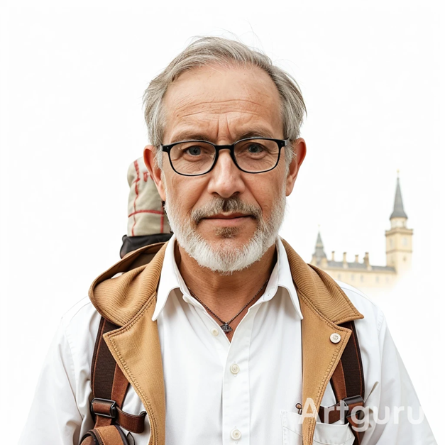

# Personas

## Persona 1: Emily Carter – The Solo Explorer

### Bio:

- **Age:** 28
- **Occupation:** Graphic Designer
- **Location:** London, UK
- **Travel Style:** Solo traveler, spontaneous, loves discovering hidden gems
- **Tech Level:** High – Very comfortable with digital tools, mobile apps, and travel platforms. Frequently uses tech for booking, planning, and sharing trips online.

### Goals:

- Discover Croatia’s hidden gems and local culture quickly
- Plan an efficient, fast-paced trip in a short time
- Track costs and travel times easily

### Frustrations:

- Finds scattered tourist information online confusing and outdated
- Wastes time figuring out opening hours, ticket prices, and travel durations

### How the app helps:

- Gives a clear overview of attractions, costs, and travel time
- Suggests itineraries tailored to her interests

### Key Features Needed:

- Personalized itineraries with top attractions, hidden gems, and estimated travel times.

### Visual Description:

A poised woman in her late 20s with sun-kissed, shoulder-length wavy brown hair, wearing a crisp white shirt and a dark scarf loosely knotted at the neck. Gold hoop earrings and a delicate heart pendant necklace catch the light.

## Persona 2: Mark & Lisa Schneider – The Family Vacationers

### Bio:

- **Age:** Mark 42, Lisa 39
- **Occupation:** Mark – Engineer, Lisa – Teacher
- **Location:** Berlin, Germany
- **Travel Style:** Family trips with two kids (ages 8 and 12)
- **Tech Level:** Moderate – Comfortable with smartphones, maps, and booking sites, but prefers straightforward, reliable apps without complicated navigation.

### Goals:

- Plan a safe and fun trip for the whole family
- Keep travel and activity planning simple and stress-free
- Avoid unexpected costs

### Frustrations:

- Finding activities suitable for children
- Planning travel routes that work with kids’ attention spans
- Managing a budget without missing important attractions
  
### How the app helps:

- Provides kid-friendly attractions and family-friendly itineraries
- Displays travel durations and costs upfront
- Helps avoid overcrowded spots or long queues

### Key Features Needed:

- Family-friendly itineraries and activity suggestions with cost overview, travel durations, and queue alerts

### Visual Description:

The pair stand shoulder-to-shoulder, pitch-ready. His light shirt is crisp, glasses sharp, backpack holding investor decks. Her white blouse and overalls project effortless hustle, pocket stuffed with sticky notes.

## Persona 3: George – The Retired Explorer

### Bio:

- **Age:** 67
- **Occupation:** Retired History Professor
- **Location:** Edinburgh, Scotland
- **Travel Style:** Prefers slow-paced, culturally rich travel. Enjoys museums, historic landmarks, and local traditions. Travels with his wife occasionally but also enjoys solo cultural trips.
- **Tech Level:** Low to Moderate – Uses technology for basic purposes (maps, booking, reading news) but prefers simple, intuitive interfaces with clear text and minimal steps.

### Goals:

- Experience Croatia’s historical sites and natural beauty without rushing
- Find reliable information about accessibility (e.g., walking difficulty, transport options)
- Plan routes that avoid stress and unnecessary walking
- Learn about cultural and historical background of attractions

### Frustrations:

- Cluttered, senior-unfriendly websites
- Difficulty comparing locations and travel times
- Misinformation about accessibility or entrance fees

### How the app helps:

- offers an easy-to-navigate interface with large, readable text and clear step-by-step trip planning
- it highlights cultural and historical attractions with verified accessibility details and estimated walking distances
- the app simplifies decision-making by presenting calm, slow-paced itineraries designed specifically for relaxed cultural travel

### Key Features Needed:

- Slow-paced, culturally focused itineraries with detailed attraction info and accessibility guidance.

### Visual Description:

A silver-haired man in his 60s with a neat beard and black glasses stands calmly in soft morning light. He wears a white field shirt under a tan corduroy vest, pockets full of tools.
