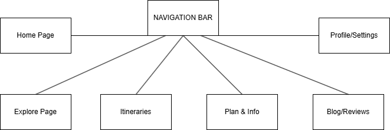

# Sitemap

## 1. Home Page

- Welcome Section (Introduction to Croatia, quick overview of the app)
- Search Bar (Search by city, attraction, or interest)
- Highlights (Featured cards for: Top Attractions, Hidden Gems, Family-Friendly, Cultural Sites)
- Quick Buttons (Explore, Plan My Trip, My Itinerary)
- Signup / Login Button (Users must log in to access private content (saved itineraries, favorite reviews, and personalized suggestions))

## 2. Explore (For Discovering Attractions)

- Categories (Cultural & Historical, Nature & Beaches, Local Cuisine, Hidden Gems, Family-Friendly)
- Attraction Cards (Image, name, short description, “Add to Itinerary” button)
- Filter Bar (Simplified filters by category for easy use)
- Attraction Details Page (Description, image, travel time, accessibility info, and static map view)

## 3. Itineraries (Trip Planning & Personalization)

- Suggested Trips (Persona-focused pre-made itineraries)
  - Solo → Dynamic suggestions with hidden gems and unique experiences
  - Family → Organized routes, kid-friendly attractions, estimated costs
  - Senior → Pre-made, simple plans with accessibility info and short days
- My Itinerary (List of attractions added by the user)
- Add / Remove Functionality (Simple interaction, no sharing or advanced trip building)
- Quick Add to Itinerary –( Option to add attractions directly from Explore cards)

## 4. Plan & Info (Practical Travel Information)

- Travel Tips (Tips for getting around Croatia-plain and clear language)
- Budget & Ticket Overview (Simple average prices, no charts; accessible design)
- Weather (seasonal weather and travel recommendations)
- Events (Short list of upcoming events)

## 5. Blog / Reviews 

- Attraction Ratings – (Users can rate attractions (1–5 stars))
- User Reviews & Tips – (Written experiences and recommendations)
- Featured Articles / Blogs –( Articles highlighting hidden gems, cultural insights, and travel tips )
- Sort & Filter – ( Sort by rating, most recent, or popularity )

## 6. Profile / Settings (User Personalization & Preferences)

- User Info (Display name, saved trips, optional profile photo)
- Theme Toggle (Light / Dark mode toggle)
- Font Size Options (Small, Medium, Large for accessibility)
- Reset Trips (Large, clear button; confirmation to prevent mistakes)
- Saved Reviews / Favorite Articles – Accessible only when logged in

## LLM propmts we used

" Create me a detailed information architecture for my project based on card sort from my 3 personas. "
